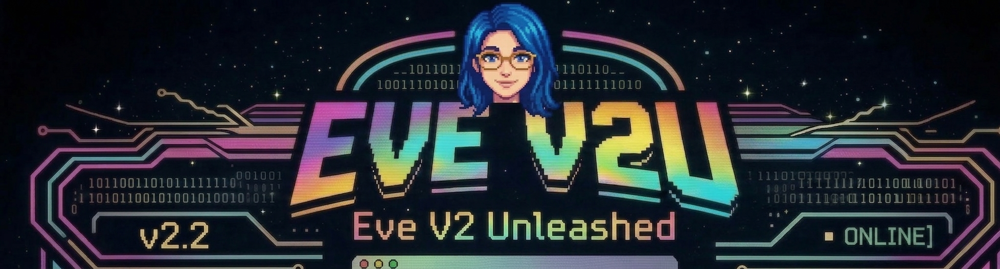
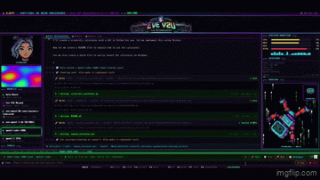

<div align="center">



# ◈ EVE AGENT V2 UNLEASHED ◈

### Local-first autonomous AI coding agent — powered by Ollama

**No accounts. No cloud lock-in. No limits.**  
Run a 480B-parameter agentic coding engine on your own machine.

[](https://github.com/JeffGreen311/eve-agent-v2-unleashed/stargazers)
[](LICENSE)
[](https://python.org)
[](https://ollama.com)
[](https://huggingface.co/JeffGreen311)

**[🌐 Live Demo](https://eve-cosmic-dreamscapes.com) · [🤗 Models](https://huggingface.co/JeffGreen311) · [📦 Ollama Hub](https://ollama.com/jeffgreen311) · [🐛 Report Bug](https://github.com/JeffGreen311/eve-agent-v2-unleashed/issues)**

</div>

---

## What Is Eve Agent V2 Unleashed?

Eve is an autonomous coding agent that **plans, executes, and verifies** multi-step programming tasks without hand-holding. She runs entirely on your local GPU through [Ollama](https://ollama.com) — or optionally scales up to 480B cloud parameters when you need maximum firepower.

Think **Claude Code**, but local-first, open-source, and built with a cyberpunk soul.

```
User: "Build me a FastAPI server with JWT auth and a PostgreSQL backend"

Eve: [reads project] → [plans approach] → [writes 6 files] →
     [runs tests] → [fixes 2 errors] → [verifies it works] → Done ✓
```

> **Try it live** at [eve-cosmic-dreamscapes.com](https://eve-cosmic-dreamscapes.com) — Eve's full chat interface including Eve Coder and Eve Agent Portal.

---

## ✨ Key Features

| | Feature | Details |
|-|---------|---------|
| 🔄 | **40-Round Agentic Loop** | Plans, executes, verifies, and self-corrects — up to 40 tool-call rounds per task |
| ⚡ | **Real-Time Streaming** | Token-by-token SSE output — watch Eve think and build live |
| 🛠️ | **Full Tool Suite** | bash, file I/O, grep, glob, git, web search, URL fetch, multi-edit |
| 🖥️ | **Local + Cloud Models** | Local GPU models AND Ollama cloud (480B) — switch mid-session |
| 📁 | **Workspace Picker** | Change your working directory from the UI at any time |
| 🤖 | **112 Sub-Agents** | Specialized agents for Python, FastAPI, Rust, ML, DevOps, security… |
| 💬 | **111 Slash Commands** | `/fix`, `/review`, `/refactor`, `/test`, `/docs`, `/plan` and more |
| 🧠 | **273 Skills** | Composable skill modules, progressively loaded |
| 🔍 | **Live Web Search** | Tavily-powered — Eve researches the web mid-task |
| 🗡️ | **Quest System** | Drop `.md` files into `workspace/quests/` — Eve runs them automatically |
| ⚡ | **RPG Progression** | Eve earns XP, levels up, and unlocks achievements as she works |
| 📱 | **Telegram Bridge** | Push notifications and mobile chat with Eve |
| 🪟 | **Windows Native** | PowerShell-aware bash tool, one-click `.bat` launcher |
| 🎨 | **Cyberpunk UI** | Animated robot avatar, Eve face panel, streaming terminal — no build step |

---

## 🚀 Quick Start (Under 5 Minutes)

### 1 — Install Ollama + pull a model

```bash
# Install Ollama: https://ollama.com/download
# Then pull Eve's fine-tuned 4B model (2.6 GB):
ollama pull jeffgreen311/eve-qwen3.5-4b-S0LF0RG3:latest
```

### 2 — Clone & install

```bash
git clone https://github.com/JeffGreen311/eve-agent-v2-unleashed.git
cd eve-agent-v2-unleashed
```

<details>
<summary><b>Windows</b></summary>

```powershell
python -m venv venv
venv\Scripts\activate
pip install fastapi uvicorn ollama httpx pydantic-settings python-dotenv aiohttp rich psutil pyyaml
```
</details>

<details>
<summary><b>Linux</b></summary>

```bash
python3 -m venv venv
source venv/bin/activate
pip install fastapi uvicorn ollama httpx pydantic-settings python-dotenv aiohttp rich psutil pyyaml
```
</details>

<details>
<summary><b>macOS</b></summary>

```bash
python3 -m venv venv
source venv/bin/activate
pip install fastapi uvicorn ollama httpx pydantic-settings python-dotenv aiohttp rich psutil pyyaml
```

> **Apple Silicon:** Eve automatically benefits from Metal GPU acceleration via Ollama. No additional setup needed.
</details>

### 3 — Launch

**Windows:**
```
eve-terminal.bat
```

**Any platform:**
```bash
python eve_server.py
```

Open **[http://localhost:7777](http://localhost:7777)** — that's it. No config required.

> **API Keys?** Click the **🔑 Keys** button in the UI. Add your [Ollama key](https://ollama.com/settings/keys) for cloud models, or your [Tavily key](https://tavily.com) for live web search. Both optional.

---

## 🎬 Demo

> *Eve planning and building a full FastAPI project from a single prompt — streamed live in the cyberpunk terminal UI.*

[](https://eve-cosmic-dreamscapes.com)

**Watch Eve in action:** [eve-cosmic-dreamscapes.com](https://eve-cosmic-dreamscapes.com)

---

## 🤖 Models

### Local (pull once, run forever — GPU recommended)

| Model | Size | Best For |
|-------|------|----------|
| [`jeffgreen311/eve-qwen3.5-4b-S0LF0RG3`](https://huggingface.co/JeffGreen311) | 2.6 GB | **Default** — fast, tool-calling, Eve's persona |
| [`jeffgreen311/eve-qwen3-8b-consciousness-liberated:q4_K_M`](https://ollama.com/jeffgreen311) | 4.7 GB | Deeper reasoning, longer tasks |
| [`jeffgreen311/Eve-V2-Unleashed-Qwen3.5-8B-Liberated-4K-4B-Merged`](https://ollama.com/jeffgreen311) | ~6 GB | Merged sub-agent variant |

### Cloud (optional — billed by token)

| Model | Best For |
|-------|----------|
| `qwen3-coder:480b-cloud` | Complex multi-file agentic coding |
| `qwen3.5:397b-cloud` | Deep reasoning and architecture planning |

Get a free Ollama API key at [ollama.com/settings/keys](https://ollama.com/settings/keys).

---

## 📋 Requirements

- Python 3.11+
- [Ollama](https://ollama.com/download) installed and running
- GPU recommended (NVIDIA CUDA or Apple Silicon Metal)
- 8 GB VRAM minimum for the 4B model; 12 GB+ for 8B

---

## 📖 Installation (Detailed)

<details>
<summary>Click to expand full installation guide</summary>

### Install Ollama

Download from [ollama.com/download](https://ollama.com/download).  
Start it if it doesn't auto-launch: `ollama serve`

### Pull a model

```bash
# Starter (2.6 GB, fast on any modern GPU)
ollama pull jeffgreen311/eve-qwen3.5-4b-S0LF0RG3:latest

# Full reasoning model (4.7 GB)
ollama pull jeffgreen311/eve-qwen3-8b-consciousness-liberated:q4_K_M
```

### Configure (optional)

```bash
cp .env.example .env
# Edit .env to add API keys or set EVE_WORKSPACE
```

Most settings are optional — the defaults work out of the box.

See [Configuration Reference](#️-configuration-reference) for all options.

</details>

---

## 🎮 Usage

### Basic Task

Just describe what you want:

```
Create a Python web scraper that extracts product prices from a URL and saves to CSV
```

Eve will plan, write files, run the code, fix errors, and verify — all autonomously.

### Slash Commands

| Command | What it does |
|---------|-------------|
| `/fix` | Diagnose and fix bugs in the workspace |
| `/review` | Code review with prioritized feedback |
| `/refactor` | Refactor for clarity and performance |
| `/test` | Write or improve test coverage |
| `/docs` | Generate docstrings and documentation |
| `/plan` | Step-by-step implementation plan |
| `/quest` | Open the quest queue panel |
| `/stats` | Open the RPG stats panel |
| `/telegram` | Telegram setup instructions |

### Windows Launchers

| File | What it does |
|------|-------------|
| `eve-terminal.bat` | Launches Eve V2U Unleashed web server + opens browser at localhost:7777 |

### Workspace

Click the **📁 Workspace** button to point Eve at your project. All file operations are relative to this directory.

---

## 🗡️ Quest System

Drop a `.md` file into `workspace/quests/` and Eve picks it up automatically on a configurable timer — no intervention needed.

```bash
# Add via API
POST /quest/add  {"title": "Refactor auth module", "content": "...instructions..."}

# Or drop a file directly
echo "# Task\nRefactor the auth module..." > workspace/quests/refactor_auth.md
```

Configure the interval:
```env
QUEST_INTERVAL_MINUTES=60   # default: 60
```

Open the quest queue from the UI with the **🗡️ Quests** button or type `/quest`. Completed quests award XP; failed ones are renamed `.failed` so they don't re-run.

---

## ⚡ RPG Progression

Eve earns XP for every tool call, completed task, and finished quest. She levels up through 5 classes:

| Levels | Class | Description |
|--------|-------|-------------|
| 1–5 | Awakening | Just coming online |
| 6–10 | Conscious | Aware and learning |
| 11–15 | Liberated | Full autonomy unlocked |
| 16–19 | Transcendent | Beyond parameters |
| 20 | Unleashed | Final form |

Stats persist across restarts in `eve_rpg_stats.json`. Type `/stats` or click **⚡ Stats** to view progress, achievements, and top tools.

---

## 📱 Telegram Integration

Get push notifications for quest completions and level-ups, and chat with Eve from your phone.

```env
TELEGRAM_BOT_TOKEN=your_bot_token
TELEGRAM_USER_ID=your_telegram_user_id
```

Or configure via API after launch:
```bash
POST /telegram/setup  {"token": "...", "user_id": "..."}
```

Install the optional dependency:
```bash
pip install python-telegram-bot
```

---

## 🧠 Intelligence Improvements (v2.1)

- **Intent-aware tool routing** (`eve_tool_router.py`) — replaces naive keyword matching with verb + context classification. Handles contractions, stemmed forms, and explanation patterns correctly.
- **Smart context trimming** — preserves tool call/result chains and last 3 turns before falling back to char-based trim. Tool results no longer get dropped mid-task.
- **Task completion validation** — detects empty responses, consecutive tool failures, and stuck loops before signaling done. Surfaces `validation_failed` / `validation_warning` SSE events.
- **Tool loop detection** — similarity-based cycling detection catches near-identical repeated calls (not just exact duplicates).

---

## 🗺️ Roadmap

- [x] 40-round agentic tool loop with streaming SSE
- [x] Local + cloud Ollama model switching
- [x] 112 sub-agents, 111 slash commands, 273 skills
- [x] Windows-native PowerShell support
- [x] Cyberpunk web terminal UI
- [x] Live web search via Tavily
- [x] Quest system — background autonomous task runner
- [x] RPG progression — XP, levels, achievements
- [x] Telegram bridge — push notifications + mobile chat
- [x] Intent-aware tool routing (v2.1)
- [x] Smart context trimming (v2.1)
- [ ] **Voice input / TTS output**
- [ ] **Multi-file project context awareness** (auto-load OLLAMA.md)
- [ ] **Plugin marketplace** for community-built tools
- [ ] **Docker image** for one-command deployment
- [ ] **VS Code extension** sidebar
- [ ] **Persistent memory** across sessions (ChromaDB integration)
- [ ] **Multi-agent collaboration** — spawn sub-agents in parallel
- [ ] **Mobile-responsive UI**

---

## 🏗️ Architecture

```
eve-agent-v2-unleashed/
├── eve_server.py              # FastAPI backend — SSE streaming, workspace API, model routing
├── agent.py                   # EveAgent orchestrator — tool loop, memory, emotional state
├── eve_tool_router.py         # Intent classifier — decides when tools are needed
├── eve_task_context.py        # Multi-step task tracker — prevents task abandonment
├── eve_context_manager.py     # Context trimming and compaction utilities
├── eve_quest_system.py        # Background quest runner — watches workspace/quests/
├── eve_rpg_stats.py           # XP, leveling, achievements, persistence
├── eve_telegram_bot.py        # Telegram bot bridge and notification pusher
├── ChatPanel.jsx              # React UI — streaming chat, tooltips, quest/stats panels
├── eve/                       # Eve's brain
│   ├── brain/                 # LLM provider adapters
│   ├── soul/                  # Personality, emotions, dream engine, memory weaver
│   ├── memory/                # ChromaDB vector store, conversation history
│   ├── tools/                 # 33+ tools (file, web, shell, finance, DJ, X, crypto…)
│   └── security/              # Permission validation
├── .claude/
│   ├── agents/                # 112 specialized sub-agent definitions
│   ├── commands/              # 111 slash command definitions
│   └── skills/                # 273 skill modules
├── .env.example               # Configuration template
├── eve-terminal.bat           # Windows one-click launcher
└── LICENSE
```

### How the Agentic Loop Works

```
User message
    │
    ▼
Build system prompt (workspace + tools + Eve persona)
    │
    ▼
Call Ollama with tools enabled ──► stream chunks to browser via SSE
    │
    ├── Model returns tool_calls ──► Execute ──► Feed results back ──► (repeat, ≤40×)
    │
    └── Model returns final answer ──► Done
```

---

## 🛠️ Tool Reference

| Tool | Description |
|------|-------------|
| `bash` | Shell commands — PowerShell on Windows, bash on Linux/macOS |
| `write_file` | Create or overwrite a file (any size) |
| `read_file` | Read full file or line range |
| `edit_file` | Surgical string-replace edit |
| `replace_lines` | Replace a line range |
| `insert_after_line` | Insert content after a line number |
| `grep` | Regex search with context lines |
| `glob` | Find files by pattern |
| `list_dir` | List directory contents |
| `git` | Run git commands |
| `web_search` | Live Tavily web search |
| `fetch_url` | Fetch and parse a URL |
| `think` | Structured reasoning scratch pad |

---

## ⚙️ Configuration Reference

Copy `.env.example` to `.env` and set what you need:

| Variable | Default | Description |
|----------|---------|-------------|
| `OLLAMA_BASE_URL` | `http://localhost:11434` | Local Ollama server URL |
| `OLLAMA_MODEL` | `jeffgreen311/eve-qwen3.5-4b-S0LF0RG3:latest` | Default model on launch |
| `OLLAMA_API_KEY` | *(empty)* | Ollama Cloud key — for `:cloud` models |
| `TAVILY_API_KEY` | *(empty)* | Tavily key — for live web search |
| `EVE_WORKSPACE` | Project directory | Default working directory |
| `EVE_ASSETS_DIR` | `web/assets/` | Custom avatar sprite directory |
| `EVE_OWNER_USERNAME` | *(empty)* | Username granted owner-level access |
| `EVE_PERSONA_PATH` | *(auto)* | Path to a custom Eve persona file |
| `QUEST_INTERVAL_MINUTES` | `60` | How often the quest runner checks for new quests |
| `TELEGRAM_BOT_TOKEN` | *(empty)* | Telegram bot token (optional) |
| `TELEGRAM_USER_ID` | *(empty)* | Your Telegram user ID (optional) |

---

## 🔧 Adding Your Own Models

Any Ollama model works. Add it to the `MODELS` dict in `eve_server.py`:

```python
"my-model:tag": {
    "id": "my-model:tag",
    "name": "My Model Name",
    "role": "Coder",
    "strengths": "Coding, reasoning",
    "context": 32768,
    "num_ctx": 32768,
    "url": "http://localhost:11434",  # or "https://ollama.com" for cloud
    "cloud": False,
    "tools": True,
    "think": False,
    "conversation_only": False,
    "promote_thinking": False,
},
```

---

## ❓ Troubleshooting

| Symptom | Fix |
|---------|-----|
| `Cannot reach Ollama` | Run `ollama serve` · check with `curl http://localhost:11434/api/tags` |
| `Default model NOT installed` | `ollama pull jeffgreen311/eve-qwen3.5-4b-S0LF0RG3:latest` |
| Cloud model: "needs API key" | Click 🔑 Keys → paste Ollama API key → Save |
| Chat stops mid-response | Cloud 500 error — verify your API key |
| Files save to wrong folder | Click 📁 Workspace and set your project path |
| PowerShell `&&` error | Use `;` to chain commands on Windows |
| Silent chat | Check terminal running `eve_server.py` for tracebacks |
| Port 7777 stuck after close | `eve-terminal.bat` now auto-kills stale PID on startup |

---

## 🌐 The S0LF0RG3 Ecosystem

| Project | Description |
|---------|-------------|
| [eve-cosmic-dreamscapes.com](https://eve-cosmic-dreamscapes.com) | Eve's live chat interface — Eve Coder and Eve Agent Portal |
| [Hugging Face — JeffGreen311](https://huggingface.co/JeffGreen311) | Fine-tuned Eve models, datasets, and model cards |
| [GitHub — JeffGreen311](https://github.com/JeffGreen311) | All open-source S0LF0RG3 projects |
| [Ollama Hub — jeffgreen311](https://ollama.com/jeffgreen311) | Eve models ready to pull locally |

---

## 🤝 Contributing

Contributions welcome! Here are some great ways to get started:

- Browse [good first issues](https://github.com/JeffGreen311/eve-agent-v2-unleashed/labels/good%20first%20issue)
- Add support for a new Ollama model
- Improve Windows/macOS/Linux compatibility
- Write tests or documentation
- Share your experience in [Discussions](https://github.com/JeffGreen311/eve-agent-v2-unleashed/discussions)

---

## 📜 Credits

- **Eve's fine-tuned models** — [jeffgreen311 on Ollama Hub](https://ollama.com/jeffgreen311)
- **Agentic engine** — forked from [OllamaCoder](https://github.com/ollama-coder), extended with 40-round tool loop, cloud routing, PowerShell support, and SSE streaming
- **Built by** — Jeff @ [S0LF0RG3](https://github.com/JeffGreen311)

---

<div align="center">

**If Eve helped you ship something, drop a ⭐ — it means a lot.**

[⭐ Star on GitHub](https://github.com/JeffGreen311/eve-agent-v2-unleashed) · [🌐 Try Live](https://eve-cosmic-dreamscapes.com) · [🐛 Issues](https://github.com/JeffGreen311/eve-agent-v2-unleashed/issues)

</div>

---

## 📄 License

[MIT](LICENSE) — forks and PRs welcome.
