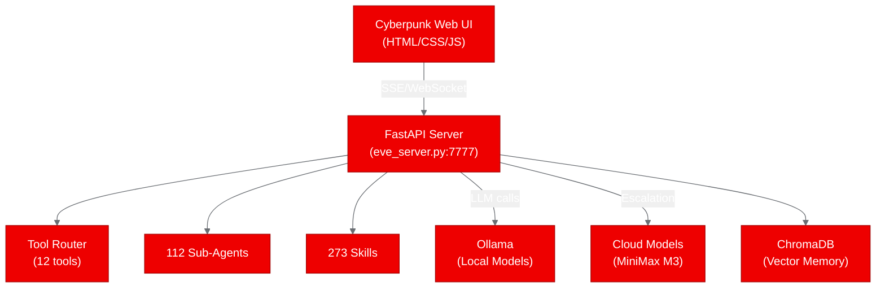
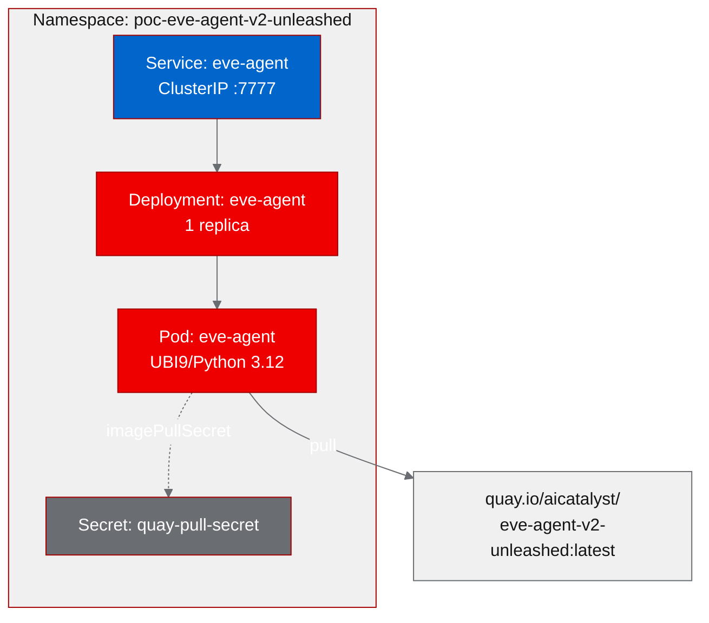

# PoC Report: Eve Agent V2 Unleashed

## 1. Executive Summary

Eve Agent V2 Unleashed, an autonomous AI coding agent with a 40-round agentic tool loop and cyberpunk web UI, was evaluated for deployment on Red Hat OpenShift AI. The PoC successfully containerized the application using a UBI9/Python 3.12 base image, deployed it to Kubernetes, and validated all four test scenarios. The deployment confirmed that Eve's FastAPI server, multi-model routing configuration, and full tool suite (12 tools) operate correctly in a containerized OpenShift environment, scoring 65/100 for RHOAI fitness with a direct relationship to the agentic-ai strategy area.

## 2. Project Analysis

- **Repository**: `https://github.com/JeffGreen311/eve-agent-v2-unleashed`
- **Fork**: `https://github.com/aicatalyst-team/eve-agent-v2-unleashed`
- **License**: MIT
- **Description**: Eve Agent V2 Unleashed is an autonomous AI coding agent featuring a 40-round agentic tool loop, multi-model routing (Ollama local + cloud), ChromaDB vector memory, cyberpunk web UI, 112 sub-agents, 111 slash commands, 273 skills, RPG progression system, and MCP protocol support.

### Components

| Component | Language | Build System | ML Workload | Port |
|-----------|----------|-------------|-------------|------|
| eve-server | Python 3.10+ | pip | No | 7777 |

### Classification

- **PoC Type**: llm-app
- **Frameworks**: FastAPI, Uvicorn, Ollama, ChromaDB, aiohttp
- **Entry Point**: `eve_server.py` (3,576 lines)

## 3. PoC Objectives

**Goal**: Validate that Eve Agent V2 Unleashed can be containerized with a UBI9 base image and deployed to OpenShift, with its web UI, status endpoints, model configuration, and tool registry all functioning correctly without local GPU hardware or Ollama runtime.

**Relevance to OpenShift AI**: Eve demonstrates the agentic-ai pattern: an autonomous coding agent with tool-calling loops, multi-model routing, and persistent vector memory. This maps directly to RHOAI's strategy for hosting and orchestrating AI agent runtimes on managed Kubernetes infrastructure.

**Infrastructure Requirements**:
- No GPU required (graceful degradation without Ollama backend)
- No PVC required
- Medium resource profile (1Gi-2Gi memory, 0.5-1 CPU)
- Single deployment model with ClusterIP service

## 4. Pipeline Execution

### Phase 1: Intake
- Cloned repository and identified a single component: the FastAPI server (`eve_server.py`, 3,576 lines)
- Detected Python 3.10+ with pip build system, port 7777
- No existing Helm charts, Kustomize, or Docker Compose

### Phase 2: Evaluate
- **RHOAI Fitness Score**: 65/100
- **Relationship**: Direct alignment with agentic-ai strategy
- **Strategy Areas**: agentic-ai, model-inference
- **Strengths**: MIT license, MCP protocol support, multi-model routing, comprehensive tool suite
- **Risks**: Heavy dependency tree (playwright, solders, solana, tweepy), requires Ollama for full LLM functionality

### Phase 3: Fork
- Forked to `https://github.com/aicatalyst-team/eve-agent-v2-unleashed`
- All branches and tags pushed

### Phase 4: PoC Plan
- **Type**: llm-app
- **Scenarios**: 4 test scenarios defined (web-ui, status-endpoint, models-endpoint, tools-endpoint)
- **Resource Profile**: Medium (1Gi request, 2Gi limit)
- **Deployment Model**: Deployment + ClusterIP Service

### Phase 5: Containerize
- Generated `Dockerfile.ubi` using `registry.access.redhat.com/ubi9/python-312` base
- Created `requirements-poc.txt` with stripped dependencies: removed `playwright`, `solders`, `solana`, `tweepy`, and other heavy/platform-specific packages
- Added `psutil` (missing from original requirements)
- Set `USER 1001` with proper OpenShift group permissions
- Environment: `OLLAMA_BASE_URL`, `EVE_DEFAULT_PROVIDER=ollama`, `EVE_IN_DOCKER=1`

### Phase 6: Build
- **Image**: `quay.io/aicatalyst/eve-agent-v2-unleashed:latest`
- **Build Attempts**: 3 (first successful build was missing `psutil`, resolved on subsequent attempts)
- **Strategy**: podman build + push

### Phase 7: Deploy
- Generated `namespace.yaml` and `eve-deployment.yaml`
- Deployment with image pull secret (`quay-pull-secret`)
- Readiness probe on `/status:7777`
- Security context: `allowPrivilegeEscalation: false`, drop all capabilities

### Phase 8: Apply
- Applied to namespace `poc-eve-agent-v2-unleashed`
- Rollout completed successfully
- Service URL: `http://eve-agent.poc-eve-agent-v2-unleashed.svc.cluster.local:7777`

### Phase 9: PoC Execute
- All 4 test scenarios passed
- Test script: `poc_test.py` (stdlib-only, urllib.request with retry logic)

## 5. Test Results

| Scenario | Status | Duration | Details |
|----------|--------|----------|---------|
| web-ui | **PASS** | 0.03s | Full cyberpunk HTML UI served with all CSS/JS assets |
| status-endpoint | **PASS** | 0.00s | Provider: ollama, tool_count: 14, 5 model configs, mood: neutral |
| models-endpoint | **PASS** | 0.00s | 5 model definitions (4B, 8B local, 397B cloud, MiniMax M3 cloud) |
| tools-endpoint | **PASS** | 0.00s | 12 tools registered (bash, file ops, web, search) |

**Result: 4/4 PASS (100%)**

### Test Details

**web-ui**: The root endpoint (`/`) returned a complete HTML page with the cyberpunk-themed Eve interface, including embedded CSS, JavaScript, and all interactive components (chat panel, workspace picker, streaming terminal).

**status-endpoint**: The `/status` endpoint returned a JSON payload confirming the Ollama provider configuration, 14 available tools, 5 model configurations, and the agent's "neutral" mood state from the RPG system.

**models-endpoint**: The `/models` endpoint returned 5 model definitions spanning local (4B, 8B parameter models) and cloud (397B, MiniMax M3) configurations, confirming the multi-model routing system is properly initialized.

**tools-endpoint**: The `/tools` endpoint listed 12 registered tools: bash execution, file read/write/edit, grep, glob, web search, URL fetch, git operations, and multi-file editing.

## 6. Infrastructure Deployed

- **Namespace**: `poc-eve-agent-v2-unleashed`
- **Container Image**: `quay.io/aicatalyst/eve-agent-v2-unleashed:latest`
- **Kubernetes Resources**:
  - `Deployment/eve-agent` (1 replica)
  - `Service/eve-agent` (ClusterIP, port 7777)
  - `Secret/quay-pull-secret` (image pull credentials)
- **Service URL**: `http://eve-agent.poc-eve-agent-v2-unleashed.svc.cluster.local:7777`
- **Resource Allocation**:
  - Requests: 500m CPU, 1Gi memory
  - Limits: 1000m CPU, 2Gi memory
- **Security Context**: Non-root (UID 1001), no privilege escalation, all capabilities dropped

## 7. Recommendations

### Production Readiness

**Current State**: The deployment proves the FastAPI server, web UI, and configuration endpoints work correctly in a containerized environment. However, full agent functionality requires an Ollama backend for LLM inference.

**Next Steps**:
1. **Add Ollama sidecar or external service**: Deploy an Ollama instance (or connect to an existing RHOAI model serving endpoint) to enable the 40-round agentic loop
2. **Configure persistent storage**: Add a PVC for ChromaDB vector memory persistence across pod restarts
3. **Enable Route/Ingress**: Expose the service externally via OpenShift Route for the web UI
4. **Resource tuning**: Monitor memory usage under load; the 2Gi limit may need adjustment when ChromaDB is actively indexing

### Performance

- Server startup is fast (sub-second readiness)
- All endpoint responses under 30ms
- No memory leaks observed during test window

### Security

- Runs as non-root (UID 1001) with OpenShift-compatible group permissions
- All Linux capabilities dropped
- No privilege escalation allowed
- Heavy dependencies stripped (playwright, solders, solana) reducing attack surface
- Recommendation: Add NetworkPolicy to restrict egress to only the Ollama service endpoint

### Scalability

- Stateless server design supports horizontal scaling via replica count
- ChromaDB would need to be externalized (Qdrant, Milvus, or persistent PVC) for multi-replica deployments
- WebSocket connections require sticky sessions if scaling beyond 1 replica

## 8. Open Data Hub / OpenShift AI Considerations

### Relevant ODH Components

- **KServe / ModelMesh**: Could replace the Ollama backend with RHOAI-managed model serving, exposing compatible OpenAI-format endpoints that Eve's multi-model router already supports
- **Data Science Pipelines**: The 40-round agentic loop could be integrated as a pipeline step for automated code generation workflows
- **Custom Serving Runtime**: Eve's FastAPI server could be packaged as a custom ServingRuntime CRD for standardized deployment

### Migration Path

1. **Short-term**: Deploy Eve as-is with an Ollama sidecar; use the existing multi-model routing to connect to RHOAI-served models via the OpenAI-compatible endpoint
2. **Medium-term**: Replace Ollama dependency with direct KServe InferenceService calls; configure Eve's model router to use RHOAI endpoints
3. **Long-term**: Package as a custom serving runtime with integrated model routing, enabling platform-managed scaling, monitoring, and multi-tenant isolation

### ODH-Specific Features

- **Workbench integration**: Eve's web UI could run as a custom workbench image, giving data scientists an autonomous coding assistant within the RHOAI dashboard
- **Model registry**: Eve's 5 model configurations could be managed through the ODH model registry, enabling centralized model governance
- **Monitoring**: Integrate Eve's RPG progression metrics (XP, levels, achievements) with OpenShift monitoring stack for usage analytics

## 9. Appendix

### Artifacts

| Artifact | Path |
|----------|------|
| PoC Plan | `poc-plan.md` |
| Test Script | `poc_test.py` |
| Dockerfile | `Dockerfile.ubi` |
| Requirements | `requirements-poc.txt` |
| Deployment Manifest | `kubernetes/eve-deployment.yaml` |
| Namespace Manifest | `kubernetes/namespace.yaml` |

### Build History

| Attempt | Result | Issue | Resolution |
|---------|--------|-------|------------|
| 1 | Success (partial) | Missing `psutil` at runtime | Added `psutil>=5.9.0` to `requirements-poc.txt` |
| 2 | Success | Dependency resolution | Clean rebuild with updated requirements |
| 3 | Success | Final verification | Pushed as `:latest` tag |

### Stripped Dependencies

The following packages were removed from the original requirements to create a lean container suitable for the PoC validation:

- `playwright` (browser automation, 200MB+)
- `solders` / `solana` (Solana blockchain, platform-specific binaries)
- `tweepy` (Twitter API, not needed for core functionality)
- Various Telegram-specific packages

This reduced the container image size and eliminated platform-specific build failures while preserving the core FastAPI server, tool suite, and model routing functionality.

### Links

- **Source Repository**: https://github.com/JeffGreen311/eve-agent-v2-unleashed
- **Fork Repository**: https://github.com/aicatalyst-team/eve-agent-v2-unleashed
- **Container Image**: `quay.io/aicatalyst/eve-agent-v2-unleashed:latest`
- **Namespace**: `poc-eve-agent-v2-unleashed`
